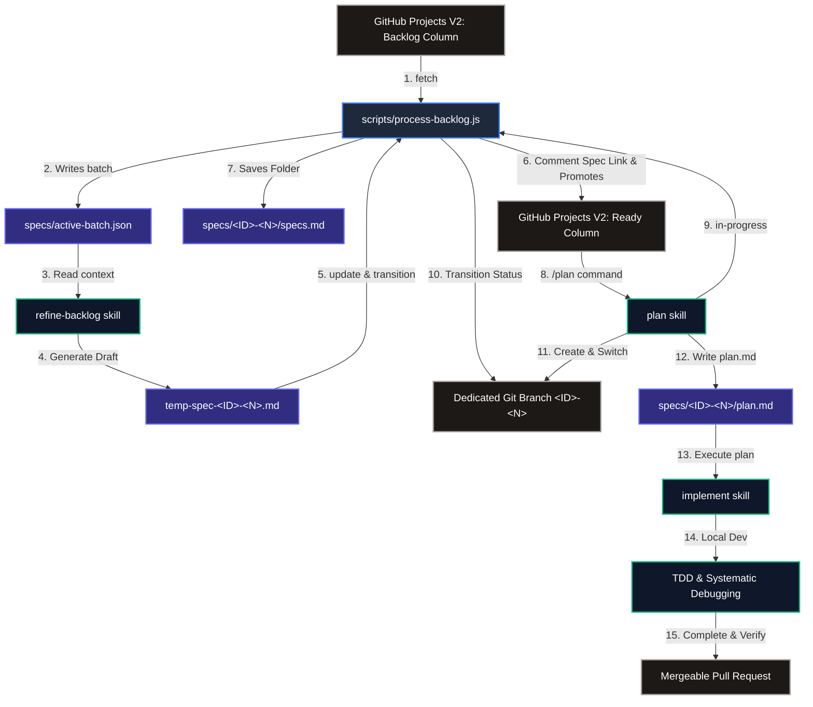

# AI Support: Reusable Backlog & Development Agent Suite

This repository contains a powerful, reusable set of scripts and AI agent skills designed to automate backlog synchronization, technical specification refinement, architectural planning, and test-driven implementation on GitHub.

By integrating these scripts and skills into your repository, you can enable an agentic developer workspace where an AI assistant acts as an **Architect** (refining backlog cards into specs), a **Planner** (breaking specs into checkable git-isolated tasks), and a **Developer** (executing plans via TDD and systematic debugging).

---

## 🏗️ Architectural Workflow

The following diagram illustrates how the zero-dependency Node.js CLI script and the three AI skills operate together to form a seamless, automated development lifecycle:



---

## 🛠️ Step-by-Step Integration Guide

Follow these instructions to integrate these scripts and skills into any new software repository.

### 1. Replicate Folder Structure

Copy the scripts and skills from this template into your new project's root folder:

```text
your-new-repository/
├── scripts/
│   ├── batch-config.json       <-- Local configuration fallback
│   └── process-backlog.js      <-- Backlog Sync CLI (Zero Dependencies!)
├── skills/
│   ├── refine-backlog/
│   │   └── SKILL.md            <-- Agent backlog refinement instruction
│   ├── plan/
│   │   └── SKILL.md            <-- Agent architectural planning instruction
│   └── implement/
│       └── SKILL.md            <-- Agent TDD implementation instruction
```

### 2. Configure Your Project

The backlog script parses configurations from two places:
1. **Root Configuration (`config.json`)**: Located in the root of the project, one level above the `scripts` folder (e.g., `./config.json` relative to the project root).
2. **Local Configuration (`scripts/batch-config.json`)**: Located directly inside the `scripts` folder. This is used as a fallback.

Create a `config.json` (or edit `scripts/batch-config.json`) with the following schema:

```json
{
  "githubUrl": "https://github.com/your-github-username/your-repository-name",
  "issueIdPattern": "PROJECT_PREFIX",
  "githubTokenEnvVar": "GITHUB_PAT",
  "owner": "your-github-username",
  "ownerType": "user",
  "repository": "your-repository-name",
  "projectNumber": 1,
  "batchSize": 3,
  "statusFieldName": "Status",
  "backlogStatusName": "Backlog",
  "readyStatusName": "Ready",
  "inProgressStatusName": "In progress",
  "priorityFieldName": "Priority",
  "specsDir": "specs",
  "scriptsDir": "scripts"
}
```

#### Configuration Fields Explained:
* `issueIdPattern`: The prefix pattern of your GitHub issues/task IDs (e.g. `KQM`, `AI`, `POD`).
* `owner` / `repository`: The GitHub user/organization handle and target repository name.
* `ownerType`: Set to `"user"` if the repo is owned by an individual account, or `"organization"` if owned by a GitHub Organization.
* `projectNumber`: The numerical ID of your GitHub Projects V2 Board (found in the project board URL).
* `batchSize`: The maximum number of cards fetched simultaneously into `active-batch.json` for processing.
* `statusFieldName`: The name of your single-select status field (defaults to `"Status"`).
* `backlogStatusName` / `readyStatusName` / `inProgressStatusName`: The exact names of the status columns on your project board.
* `specsDir`: The directory inside the repository where specifications and plans are stored (defaults to `"specs"`).

### 3. Setup Authentication

The CLI script requires a **GitHub Personal Access Token (PAT)** to interact with your Project Board V2 and issue comments.

1. Generate a classic PAT on GitHub with the following scopes:
   * **`repo`** (Full control of private repositories)
   * **`project`** (Full control of user/org Project V2 boards)
2. Export the token to the environment variable specified in your configuration (`GITHUB_PAT` by default):
   * **PowerShell (Windows)**:
     ```powershell
     $env:GITHUB_PAT="ghp_yourPersonalAccessTokenHere"
     ```
   * **Bash (Linux/macOS)**:
     ```bash
     export GITHUB_PAT="ghp_yourPersonalAccessTokenHere"
     ```
   * **CMD (Windows)**:
     ```cmd
     set GITHUB_PAT=ghp_yourPersonalAccessTokenHere
     ```

---

## ⚡ CLI Tool Commands

The sync tool `scripts/process-backlog.js` is a standalone, **zero-dependency Node.js CLI** (no `npm install` required).

| Command | Description | Example |
|---|---|---|
| **`list`** | Lists all open issues in the **Backlog** column of the board, sorted by priority (High $\rightarrow$ Medium $\rightarrow$ Low). | `node scripts/process-backlog.js list` |
| **`fetch`** | Fetches the top prioritized issues up to `batchSize` and saves them to `<specsDir>/active-batch.json`. | `node scripts/process-backlog.js fetch` |
| **`in-progress <num>`** | Moves a specific issue by number to the **In Progress** column on the Project board. | `node scripts/process-backlog.js in-progress 42` |
| **`update <num> --spec-file <path>`** | Copies the refined spec to `<specsDir>/<PREFIX>-<num>/specs.md`, comments on the issue with a link, and promotes the issue to the **Ready** column. | `node scripts/process-backlog.js update 42 --spec-file specs/temp-spec-PROJ-42.md` |
| **`update <num> --spec-file <path> --split-issues <json-path>`** | Promotes parent issue *and* auto-creates multiple sub-issues, linking their sub-specs, and adding them to the board's **Ready** column. | `node scripts/process-backlog.js update 42 --spec-file specs/temp-spec.md --split-issues specs/split.json` |

---

## 🤖 Activating Skills in Your AI Workspace

Once copy-pasted into your repository, the three skill files (`skills/**/SKILL.md`) act as executable playbooks for your AI programming assistant (like Gemini or Claude running in an agentic workspace). 

### 1. Refine Backlog Skill (`skills/refine-backlog/SKILL.md`)
* **When triggered**: Automatically when backlog refinement or active batch processing is requested.
* **Agent action**: Runs `process-backlog.js fetch` $\rightarrow$ Researches codebase files relevant to the active issues $\rightarrow$ Generates robust specification markdown files (`specs.md`) using repository-relative paths $\rightarrow$ Commits specs $\rightarrow$ Transitions issues to **Ready** using `process-backlog.js update`.

### 2. Plan Skill (`skills/plan/SKILL.md`)
* **When triggered**: User issues a `/plan <PREFIX>-<N>` command (e.g. `/plan KQM-29`).
* **Agent action**: Automatically checks out or creates a dedicated git branch named `<PREFIX>-<N>` $\rightarrow$ Transitions the issue status to **In Progress** via `process-backlog.js in-progress` $\rightarrow$ Reads the spec file $\rightarrow$ Runs the planning engine to write a localized, checkable, task-by-task execution plan saved directly as `<specsDir>/<PREFIX>-<N>/plan.md`.

### 3. Implement Skill (`skills/implement/SKILL.md`)
* **When triggered**: User requests to implement `<PREFIX>-<N>`.
* **Agent action**: Validates that a `plan.md` exists (halts and prompts if missing) $\rightarrow$ Switches to the dedicated branch $\rightarrow$ Runs Test-Driven Development (TDD) $\rightarrow$ Leverages systematic debugging to resolve failures $\rightarrow$ Verifies outputs with strict checks $\rightarrow$ Closes out the development branch for code review.

---

## 💡 Best Practices

1. **Repository-Relative Paths in Specifications**: All files, classes, or directories referenced in the specification files (`specs.md`) or plans (`plan.md`) must be written as repository-relative paths (e.g., `src/Core/Services/QueueService.cs`), not absolute paths. This guarantees that hyperlinks are fully clickable on GitHub and work seamlessly across different developer machines.
2. **Secrets Separation**: Never commit your Personal Access Token or sensitive fields. Store them strictly as environment variables, and use `../config.json` in the parent directory of your workspace to avoid leaking absolute project paths or credentials.
3. **Task Isolation**: By forcing git branches to match the issue key (e.g. `KQM-29`), you guarantee that all specifications, implementation plans (`plan.md`), tests, and source codes are perfectly isolated to that specific task branch before a PR review.
