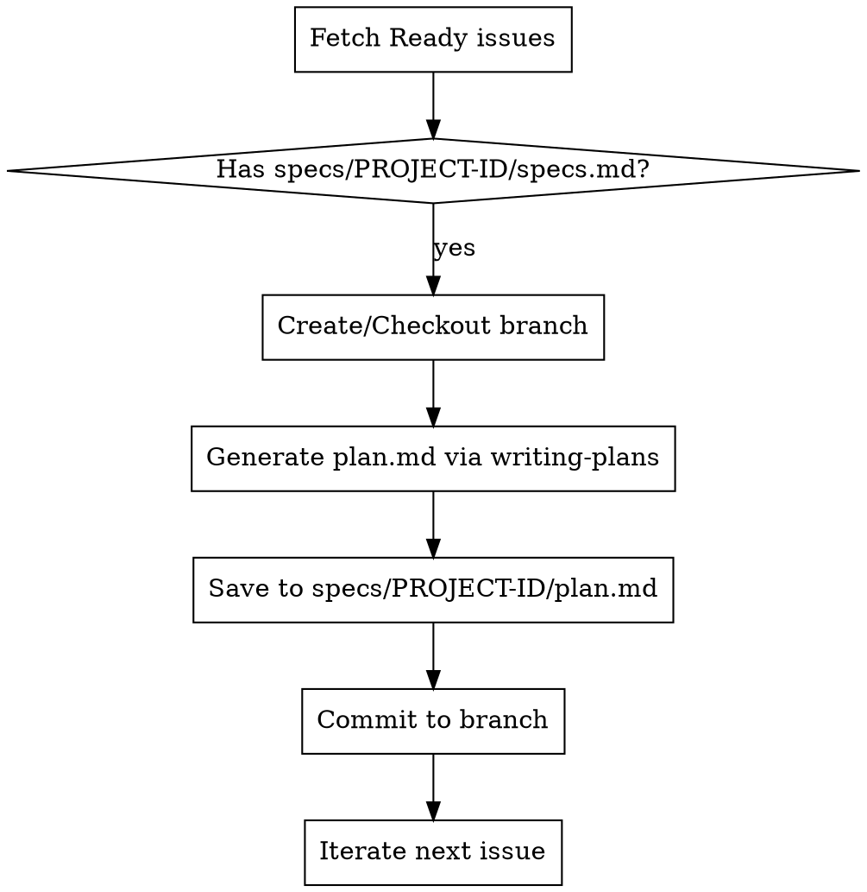

# Batch Plan

## Overview
Generate implementation plans (`plan.md`) in batch for all project issues in the "Ready" column of the project board, checking each plan into its own dedicated issue branch.

## When to Use
- When the user runs the `/batch-plan` command.
- When multiple issues are ready for implementation planning and the user requests batch planning.
- When planning needs to be run unattended without individual section-by-section walkthroughs.

## Process Flow



## Step-by-Step Implementation

1. **Parse Configuration**:
   - Locate `config.json` in the project root. If not found, use `scripts/batch-config.json`.
   - Retrieve:
     - `owner` / `repository`
     - `issueIdPattern` (referred to as `$PROJECT_PREFIX`)
     - `readyStatusName` (defaults to `"Ready"`)
     - `specsDir` (defaults to `"specs"`)
2. **Fetch Issues**:
   - Query the GitHub GraphQL Project V2 API (or REST API) to fetch all issues currently in the `"Ready"` status.
3. **Generate Plans in Branch**:
   - For each issue (e.g. issue #10):
     - Identify the `$PROJECT_PREFIX` (e.g., `TEST`) and the issue ID/number (e.g., `10`).
     - Check if the specification `specs/$PROJECT_PREFIX-$ISSUE_ID/specs.md` exists. If not, log a warning and skip.
     - Create or check out a git branch named `$PROJECT_PREFIX-$ISSUE_ID` (e.g., `TEST-10`).
     - Invoke `superpowers:writing-plans` to generate the plan.
     - **CRITICAL**: Do **NOT** provide a guided walkthrough or prompt the user for section-by-section review. All reviews will be conducted in a batch later.
     - Save the plan as `specs/$PROJECT_PREFIX-$ISSUE_ID/plan.md` in that branch.
     - Commit the `plan.md` file to the branch:
       ```bash
       git add specs/$PROJECT_PREFIX-$ISSUE_ID/plan.md
       git commit -m "docs: add batch implementation plan"
       ```
     - Return to the original branch before moving to the next issue.
4. **Final Summary**:
   - Output a list of issues planned and the created branch names.

## Quick Reference

| Action | Target / Command |
|---|---|
| Load Config | `config.json` or fallback to `scripts/batch-config.json` |
| Target Branch | `$PROJECT_PREFIX-$ISSUE_ID` (e.g., `TEST-10`) |
| Save Plan Path | `specs/$PROJECT_PREFIX-$ISSUE_ID/plan.md` |
| Review | Skip interactive walkthrough entirely |

## Bulletproofing & Rationalization Defense

To resist shortcuts and rationalizations under pressure:

### Rationalization Table

| Excuse | Reality |
|--------|---------|
| "Doing branch checkouts is slow; I'll write all plans in main." | Bypassing branch isolation is a critical defect. Plans must be written in their own `$PROJECT_PREFIX-$ISSUE_ID` branches. |
| "I should ask the user to review each plan as I generate them." | Batch planning is designed to run unattended. You MUST skip the guided walkthrough and plan reviews. |
| "I can't find config.json, so I'll guess the project prefix." | You must fall back to `scripts/batch-config.json` to read the correct `issueIdPattern`. |

### Red Flags - STOP and Correct
- Prompting the user with plan walkthroughs or review requests during batch planning.
- Writing multiple plans to the same branch or `main` instead of their respective issue branches.
- Bypassing TDD planning constraints.
